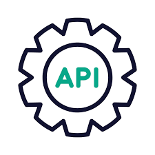

<!-- Improved compatibility of back to top link: See: https://github.com/othneildrew/Best-README-Template/pull/73 -->
<a name="readme-top"></a>
<!--
*** Thanks for checking out the Best-README-Template. If you have a suggestion
*** that would make this better, please fork the repo and create a pull request
*** or simply open an issue with the tag "enhancement".
*** Don't forget to give the project a star!
*** Thanks again! Now go create something AMAZING! :D
-->


<!-- PROJECT SHIELDS -->
<!--
*** I'm using markdown "reference style" links for readability.
*** Reference links are enclosed in brackets [ ] instead of parentheses ( ).
*** See the bottom of this document for the declaration of the reference variables
*** for contributors-url, forks-url, etc. This is an optional, concise syntax you may use.
*** https://www.markdownguide.org/basic-syntax/#reference-style-links
-->
[![Contributors][contributors-shield]][contributors-url]
[![Forks][forks-shield]][forks-url]
[![Stargazers][stars-shield]][stars-url]
[![Issues][issues-shield]][issues-url]
[![LinkedIn][linkedin-shield]][linkedin-url]


<!-- PROJECT LOGO -->
<br />
<div align="center">
  <a href="https://github.com/SalvatoreDag/Salvatore-D-Agostino-PHP-MYSQL">
    
  </a>

<h3 align="center">Progetto PHP-MYSQL per Start2Impact</h3>

  <p align="center">
    API JSON RESTful per il progetto del corso PHP-MYSQL
    <br />
    <a href="https://github.com/SalvatoreDag/Salvatore-D-Agostino-PHP-MYSQL"><strong>Explore the docs »</strong></a>
    <br />
    <br />
    ·
    <a href="https://github.com/SalvatoreDag/Salvatore-D-Agostino-PHP-MYSQL/issues">Report Bug</a>
    ·
    <a href="https://github.com/SalvatoreDag/Salvatore-D-Agostino-PHP-MYSQL/issues">Request Feature</a>
  </p>
</div>


<!-- TABLE OF CONTENTS -->
<details>
  <summary>Table of Contents</summary>
  <ol>
    <li>
      <a href="#informazioni-sul-progetto">Informazioni sul progetto</a>
      <ul>
        <li><a href="#sviluppato-con">Sviluppato con</a></li>
      </ul>
    </li>
    <li>
      <a href="#usare-le-api">Usare le API</a>
      <ul>
        <li><a href="#prestazioni-offerte">Prestazioni Offerte</a></li>
        <li><a href="#prestazioni-erogate">Prestazioni Erogate</a></li>
        <li><a href="#tempo-risparmiato">Tempo Risparmiato</a></li>
      </ul>
    </li>
    <li><a href="#contact">Contatti</a></li>
  </ol>
</details>


<!-- ABOUT THE PROJECT -->
## Informazioni sul progetto

<p>API JSON RESTful per la startup Bonny che ha l'obiettivo di rendere pià accessibili i bonus statali</p>

<p align="right">(<a href="#readme-top">back to top</a>)</p>


### Sviluppato Con

* <a href="https://www.php.net/">PHP</a>
* <a href="https://www.mysql.com/">MY SQL</a>
<p align="right">(<a href="#readme-top">back to top</a>)</p>


<!-- GETTING STARTED -->
## Come Usare le Api

Le API permettono di leggere, inserire, modificare, eliminare le prestazioni offerte ed erogate. Permetto poi di poter visualizzare il tempo totale
risparmiato dai cittadini e di filtrare per data e prestazione.

### Prestazioni offerte

1. Per leggere tutte le prestazioni offerte usare il metodo GET e inserire http://php-mysql.test/services
2. Per leggere una prestazione offerte in particolare usare il metodo GET e inserire http://php-mysql.test/services/{id} 
3. Per inserire una prestazione offerte usare il metodo POST e inserire http://php-mysql.test/services
4. Per modificare una prestazione offerte usare il medoto PUT e inserire http://php-mysql.test/services/{id}
5. Per eliminare una prestazione offerte usare il metodo DELETE e inserire http://php-mysql.test/services/{id}/delete

### Prestazioni erogate

1. Per leggere tutte le prestazioni erogate usare il metodo GET e inserire http://php-mysql.test/provided
2. Per leggere una prestazione erogata in particolare usare il metodo GET e inserire http://php-mysql.test/provided/{id} 
3. Per inserire una prestazione erogata usare il metodo POST e inserire http://php-mysql.test/provided
4. Per modificare una prestazione erogata usare il medoto PUT e inserire http://php-mysql.test/provided/{id}
5. Per eliminare una prestazione erogata usare il metodo DELETE e inserire http://php-mysql.test/provided/{id}/delete

### Tempo Rispamiato

1. Per leggere il tempo totale risparmiato usare il metodo GET e inserire http://php-mysql.test/saved
2. Per filtrare le prestazioni in base alla data usare il metodo GET e inserire http://php-mysql.test/date/:initialDate/:finalDate
3. Per filtrare una prestazione in base alla tipologia usare il metodo GET e inserire http://php-mysql.test/typology/:type
<strong> (se la tipologia di prestazione contiene più parole dividerle usanto "-" Esempio: water-bonus)</strong>

### Installation

1. Get a free API Key at [https://example.com](https://example.com)
2. Clone the repo
   ```sh
   git clone https://github.com/github_username/repo_name.git
   ```
3. Install NPM packages
   ```sh
   npm install
   ```
4. Enter your API in `config.js`
   ```js
   const API_KEY = 'ENTER YOUR API';
   ```

<p align="right">(<a href="#readme-top">back to top</a>)</p>


<!-- CONTACT -->
## Contact

Salvatore D'Agostino - salvatore.dagostino.work@gmail.com

<p align="right">(<a href="#readme-top">back to top</a>)</p>


<!-- MARKDOWN LINKS & IMAGES -->
<!-- https://www.markdownguide.org/basic-syntax/#reference-style-links -->
[contributors-shield]: https://img.shields.io/github/contributors/SalvatoreDag/Salvatore-D-Agostino-PHP-MYSQL.svg?style=for-the-badge
[contributors-url]: https://github.com/SalvatoreDag/Salvatore-D-Agostino-PHP-MYSQL/graphs/contributors
[forks-shield]: https://img.shields.io/github/forks/SalvatoreDag/Salvatore-D-Agostino-PHP-MYSQL.svg?style=for-the-badge
[forks-url]: https://github.com/SalvatoreDag/Salvatore-D-Agostino-PHP-MYSQL/network/members
[stars-shield]: https://img.shields.io/github/stars/SalvatoreDag/Salvatore-D-Agostino-PHP-MYSQL.svg?style=for-the-badge
[stars-url]: https://github.com/SalvatoreDag/Salvatore-D-Agostino-PHP-MYSQL/stargazers
[issues-shield]: https://img.shields.io/github/issues/SalvatoreDag/Salvatore-D-Agostino-PHP-MYSQL.svg?style=for-the-badge
[issues-url]:https://github.com/SalvatoreDag/Salvatore-D-Agostino-PHP-MYSQL/issues
[linkedin-shield]: https://img.shields.io/badge/-LinkedIn-black.svg?style=for-the-badge&logo=linkedin&colorB=555
[linkedin-url]: https://www.linkedin.com/in/salvatore-d-agostino/
